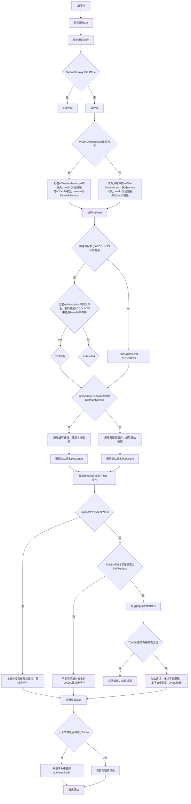

# docker-image-proxy

## 技术栈
- GO
- GIN
- Docker Registry API v2

## 功能
1. 代理docker镜像仓库，解决docker客户端无法在本地访问上游镜像仓库的问题
2. 支持docker镜像的pull、search等操作
3. 支持以下Docker Registry API v2接口：
   - GET /v2/ 获取鉴权 www-authenticate 头信息，并进行改写，改写为当前服务地址，并返回
   - GET /v2/auth - 解析 docker 客户端发送过来的 authorization 头信息，并转发给上游鉴权服务
   - GET /v2/_catalog - 获取镜像仓库列表
   - GET /v2/:name/tags/list - 获取镜像标签列表
   - GET /v2/:name/manifests/:reference - 获取镜像manifest
   - GET /v2/:name/blobs/:digest - 获取镜像层

处理逻辑流程图：


## 环境要求
- Go 1.21或更高版本
- Docker客户端（用于测试）

## 配置
可以通过环境变量配置代理服务器：

- `PORT`: 服务器监听端口（默认：8080）
- `UPSTREAM_REGISTRY`: 上游Docker Registry地址（默认：`https://registry-1.docker.io`）
- `SELF_REGISTRY`: 当前服务地址（默认：`http://localhost:8080`）
- `SELF_AUTH_SERVICE`: 当前服务鉴权服务名称（默认：`docker-image-proxy`）
- `ACCOUNTS`: 账号列表，用逗号分隔（默认：空）,如果配置了，必须用相应账号名和密码进行调用，否则会报错
- `SKIP_AUTH_PROXY`: 是否跳过鉴权代理（默认：`false`），如果为`true`，则不进行鉴权代理，直接使用上游站点的鉴权服务
- `SERVER_SECRET`: 服务端加密密钥（默认：随机生成），如果`SKIP_AUTH_PROXY`为false，并且上游站没有鉴权，则使用本站进行鉴权，本站鉴权成功后会签发token,token 使用的 HMAC-SHA256 算法，使用 `SERVER_SECRET` 作为密钥，TOKEN中ISS字段为 `SELF_AUTH_SERVICE`

## 构建和运行

1. 构建项目：
```bash
go build -o docker-image-proxy ./cmd/server
```

2. 运行服务：
```bash
# 使用默认配置
./docker-image-proxy

# 自定义配置
PORT=5000 UPSTREAM_REGISTRY=https://registry.example.com ./docker-image-proxy
```

## 使用示例

1. 配置Docker客户端使用代理：
```bash
# 编辑或创建 /etc/docker/daemon.json
{
  "registry-mirrors": ["http://localhost:8080"]
}

# 重启Docker服务
sudo systemctl restart docker
```

2. 使用Docker命令：
```bash
# 搜索镜像
docker search nginx

# 拉取镜像
docker pull nginx:latest

# 查看镜像标签
curl http://localhost:8080/v2/nginx/tags/list
```

## 开发

1. 克隆项目：
```bash
git clone https://github.com/yourusername/docker-image-proxy.git
cd docker-image-proxy
```

2. 安装依赖：
```bash
go mod tidy
```

3. 运行测试：
```bash
go test ./...
```

## 许可证
MIT License
